<div align="center">


[](https://git.io/typing-svg)

<p>
  <a href="https://ceekayx.vercel.app/">
    
  </a>
  <a href="mailto:muhddck@gmail.com">
    
  </a>
  <a href="https://www.linkedin.com/in/mohammad-ibrahim-938b19115/">
    
  </a>
</p>



</div>

## Hello, I'm Mohammad Ibrahim

I'm a senior full-stack developer and the founder of **Ceekayx**, building production-grade software across fintech, SaaS, real estate, hospitality, and enterprise operations. I work from product ideation and system architecture through implementation, cloud deployment, and long-term optimization.

My core stack centers on **Laravel/PHP, Node.js, React, Vue, Python, PostgreSQL, and AWS**, with additional experience in mobile applications, payment infrastructure, offline-first systems, and RAG-powered AI features.

```ts
const ceekayx = {
  role: "Senior Full Stack Developer & Principal Architect",
  experience: "6+ years in production",
  focus: ["Enterprise SaaS", "Cloud Architecture", "AI & RAG", "Fintech APIs"],
  location: ["Kano, Nigeria", "Kyrenia, Cyprus"],
  status: "Open to high-impact projects and technical partnerships",
};
```

## Impact in production

| Result | Work behind it |
| :---: | --- |
| **35% less downtime** | Led an infrastructure migration to AWS for CIFA Cyprus & UK |
| **30% organic growth** | Delivered technical SEO improvements for Century 21 properties |
| **15% faster deployments** | Automated delivery pipelines for financial web applications |
| **End-to-end fintech delivery** | Built POS, payment, ISO 8583, Interswitch, and Flutterwave integrations |

## What I engineer

| Area | Capabilities |
| --- | --- |
| **Enterprise software** | SaaS platforms, CRMs, admin systems, multi-branch operations, and secure role-based workflows |
| **Backend systems** | REST APIs, authentication, queues, webhooks, payment routing, caching, and database optimization |
| **AI & automation** | RAG pipelines, document assistants, LLM integrations, embeddings, and workflow intelligence |
| **Cloud & DevOps** | AWS, DigitalOcean, Docker, Kubernetes, CI/CD, observability, and resilient deployments |
| **Web & mobile** | Responsive React/Vue experiences, Android and Flutter apps, and offline-first architecture |

## Technology stack

<div align="center">

### Languages and frameworks


### Data, cloud, and delivery


</div>

## Selected engineering work

- **AI Knowledge Assistant** — a React and Python RAG experience using LLMs, vector search, document ingestion, and cited answers.
- **Offline-first POS** — resilient transaction flows with local storage, synchronization, conflict handling, payment APIs, and hardware peripherals.
- **Intendox Real Estate Platform** — multilingual Node.js and Vue architecture with AWS S3 migration and technical SEO.
- **CIFA Cloud Migration** — AWS infrastructure, Redis caching, Laravel query optimization, secure APIs, and GDPR-conscious data handling.
- **Enterprise management suites** — healthcare, LPG, retail, and school platforms with real-time dashboards, multi-branch control, and granular permissions.

Explore the fuller case-study and product catalogue on the [Ceekayx portfolio](https://ceekayx.vercel.app/#projects).

## Experience snapshot

```text
2023 — Present  Senior Full Stack Web Developer · JLD Aveo Plus
2022 — 2023     Lead Web Developer              · CIFA Cyprus & UK
2021 — 2024     Full Stack Web Developer        · Intendox Investments
2020 — 2021     Backend Developer               · Invest North Cyprus
2020 — Present  Independent Consultant          · Fintech, SaaS & enterprise clients
```

I hold a **B.Sc. in Computer Engineering** from Girne American University and certifications in **Cybersecurity Career Essentials** and **The Cybersecurity Threat Landscape**.

## GitHub activity

<div align="center">


</div>

## Let's build something dependable

I'm available for enterprise contracts, product partnerships, architecture consulting, and custom software builds.

<div align="center">

[**Portfolio**](https://ceekayx.vercel.app/) · [**Email**](mailto:muhddck@gmail.com) · [**LinkedIn**](https://www.linkedin.com/in/mohammad-ibrahim-938b19115/) · [**GitHub**](https://github.com/dceekay)


</div>
