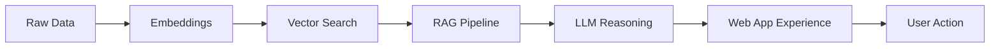

<div align="center">


[](https://git.io/typing-svg)

<p>
  <a href="https://ceekayx.com/">
    
  </a>
  <a href="mailto:hello@ceekayx.com">
    
  </a>
  <a href="https://ceekayx.com/#contact">
    
  </a>
</p>

</div>

---

## About Me

I am a software engineer and AI enthusiast focused on building modern web applications, intelligent product features, and reliable cloud systems. I like clean interfaces, fast APIs, useful automation, and AI that solves real problems instead of just looking impressive in a demo.

My work lives where product, engineering, and infrastructure meet:

- Full-stack web apps with polished frontend experiences and dependable backend systems
- AI-powered applications using LLMs, RAG, embeddings, automation, and workflow intelligence
- Cloud-native deployments with security, observability, and performance built in early
- Business tools, dashboards, portals, SaaS products, internal systems, and custom platforms

---

## What I Build

| Focus | What I Deliver |
| --- | --- |
| Web Applications | Responsive, production-ready apps using React, Vue, Next.js, TypeScript, Tailwind, and modern UI patterns |
| Backend Systems | REST APIs, authentication, databases, queues, workers, real-time features, and scalable service architecture |
| AI Integrations | Chatbots, RAG assistants, document intelligence, AI search, automation agents, and LLM-powered product features |
| Cloud Infrastructure | AWS deployments, Dockerized services, CI/CD, monitoring, caching, and resilient architecture |
| Product Engineering | Admin dashboards, customer portals, marketplaces, POS tools, CRMs, booking systems, and workflow apps |

---

## Tech Arsenal

<div align="center">

### Languages


### Frontend


### Backend, AI, and Cloud


### Data


</div>

---

## AI Enthusiast Mode



I am especially interested in AI features that make software feel faster, smarter, and more useful:

- Document Q&A and knowledge assistants
- AI search over private business data
- Chat interfaces with reliable retrieval and citations
- Workflow automation for repetitive business tasks
- Admin copilots for dashboards, CRMs, and internal tools
- Product features powered by LLMs, embeddings, and structured outputs

---

## Featured Project Types

| Project | Stack | Highlights |
| --- | --- | --- |
| AI Knowledge Assistant | React, Python, Vector DB, LLMs | RAG pipeline, citations, document ingestion, explainable answers |
| Real Estate Platform | React, Node.js, PostgreSQL, Redis | Search, listings, admin tools, availability sync, scalable APIs |
| Offline-First POS | Vue, IndexedDB, Node.js, PostgreSQL | Local-first transactions, sync engine, conflict resolution |
| SaaS Dashboard | Next.js, TypeScript, Prisma, AWS | Auth, billing-ready architecture, analytics, team workflows |
| Business Automation App | Laravel, queues, APIs, AI tools | Role-based access, background jobs, integrations, reporting |

---

## Engineering Principles

```yaml
reliability:
  - design for failure before production teaches the lesson
  - build observability into the system early
  - test the paths users depend on most

security:
  - protect APIs, data, sessions, and infrastructure by default
  - keep authentication and authorization boring in the best way
  - review risk before shipping

performance:
  - optimize database access where it matters
  - cache intentionally
  - make mobile and low-network users first-class citizens

ownership:
  - understand the product, not only the ticket
  - ship maintainable code
  - leave systems easier to operate than they were found
```

---

## GitHub Motion

<div align="center">


</div>

---

## Open To

- Custom web applications and SaaS products
- AI-powered apps, chatbots, copilots, and automation tools
- Cloud architecture, backend systems, and API development
- Admin dashboards, portals, internal tools, and business platforms
- Performance tuning, security hardening, and production readiness

---

## Current Build Energy

```bash
$ idea="useful AI + clean UX + reliable infrastructure"
$ stack="React TypeScript Node Python Laravel AWS Docker"
$ mode="ship polished web apps that solve real problems"
$ status="available for serious builds"
```

---

<div align="center">


**Engineered for scale. Designed for people. Powered by curiosity.**

</div>
